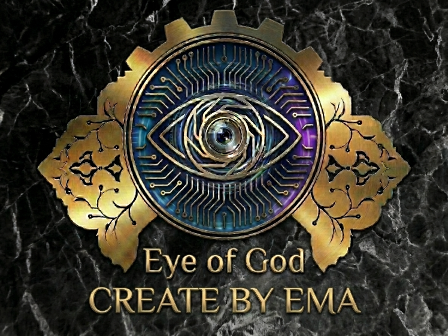

<p align="center">
  
</p>

<h1 align="center">GOD EYE — سیستم بینایی ماشین</h1>

<p align="center">
  سیستم هوشمند نظارت تصویری با پردازش بلادرنگ شامل تشخیص چهره، تشخیص اشیا، و خواندن پلاک خودرو
</p>

<p align="center">
  
  
  
  
</p>

---

## قابلیت‌ها

### تشخیص و بازشناسی چهره
- تشخیص چهره با **YuNet** (دقت 99%+)
- بازشناسی هویت با **SFace** (دقت 99.4%)
- ذخیره و مدیریت پروفایل افراد (نام، سن، شغل، توضیحات)
- ویرایش و حذف پروفایل کاربران
- تشخیص چهره‌های ناشناس و ذخیره خودکار
- ردیابی چهره‌ها با شناسه اختصاصی

### تشخیص اشیا
- تشخیص 80 کلاس اشیا با **YOLOv8n**
- تشخیص ماشین، موتور، حیوانات، لوازم خانگی و بسیاری اشیای دیگر
- نمایش نام و اطمینان تشخیص روی هر شیء

### تشخیص پلاک خودرو
- تشخیص پلاک خودرو و موتور با مدل **YOLO11n**
- خواندن متن پلاک فارسی و انگلیسی با **EasyOCR**
- ذخیره خودکار تصاویر پلاک‌های تشخیص داده شده
- لاگ پلاک‌ها با تاریخ و ساعت

### قابلیت‌های تکمیلی
- **تشخیص عبور از خط** — شمارش افراد در حال ورود و خروج
- **هشدار منطقه** — تعریف منطقه ممنوعه و آلارم نقض
- **نقشه حرارتی** — نمایش تراکم چهره‌ها
- **تشخیص حرکت** — هشدار حرکت در صحنه
- **حالت شب** — بهبود تصویر در نور کم
- **تار کردن چهره ناشناس** — محو خودکار چهره‌های ناشناخته
- **زوم هوشمند** — بزرگنمایی خودکار روی نزدیک‌ترین چهره
- **شاتر اتوماتیک** — ثبت تصویر چهره‌های ناشناس
- **ضبط ویدیو** — ذخیره ویدیو با فرمت AVI
- **گالری اسکرین‌شات** — مشاهده تصاویر ثبت شده
- **خروجی CSV** — استخراج لاگ‌ها به فایل اکسل
- **توصیف صحنه** — خلاصه‌سازی متنی صحنه

### رابط کاربری
- رابط گرافیکی مدرن با **CustomTkinter** (تم GitHub Dark)
- صفحه نمایش تمام صفحه
- سایدبار اسکرول‌پذیر با تمام کنترل‌ها
- نوار وضعیت با FPS، تعداد افراد، اشیا و پلاک‌ها
- پنل اطلاعات چهره در لحظه

---

## پیش‌نیازها

- Python 3.10+
- دوربین USB یا وب‌کم داخلی
- حداقل 4GB RAM

## نصب و اجرا

```bash
# کلون کردن پروژه
git clone https://github.com/emadch82/GOD-EYE.git
cd GOD-EYE

# نصب پیش‌نیازها
pip install -r requirements.txt

# نصب EasyOCR (برای تشخیص پلاک)
pip install easyocr

# اجرای برنامه
python app.py
```

> در اجرای اول، مدل‌های هوش مصنوعی به صورت خودکار دانلود می‌شوند.

---

## ساختار پروژه

```
GOD-EYE/
├── app.py                 # اپلیکیشن اصلی (رابط کاربری + منطق)
├── config.py              # تنظیمات و مسیرها
├── face_detector.py       # تشخیص چهره (YuNet)
├── face_recognizer.py     # بازشناسی چهره (SFace)
├── object_detector.py     # تشخیص اشیا (YOLOv8)
├── model_downloader.py    # دانلود خودکار مدل‌ها
├── webcam_manager.py      # مدیریت دوربین
├── ml_trainer.py          # آموزش مدل‌های یادگیری ماشین
├── main.py                # نقطه ورود CLI
├── requirements.txt       # پیش‌نیازها
├── models/
│   ├── yunet_2023mar.onnx      # مدل تشخیص چهره
│   ├── sface_2021dec.onnx      # مدل بازشناسی چهره
│   └── plates.onnx             # مدل تشخیص پلاک
├── logo.png               # لوگوی پروژه
└── captured_plates/       # تصاویر پلاک‌های ذخیره شده
```

---

## مدل‌های هوش مصنوعی

| مدل | وظیفه | دقت | حجم |
|------|--------|------|-----|
| YuNet | تشخیص چهره | 99%+ | 0.2 MB |
| SFace | بازشناسی چهره | 99.4% | 36.9 MB |
| YOLOv8n | تشخیص اشیا (80 کلاس) | — | 12 MB |
| YOLO11n | تشخیص پلاک | — | 10.1 MB |

---

## کلیدهای میانبر

| کلید | عملکرد |
|-------|--------|
| `F11` | تمام صفحه / حالت عادی |


